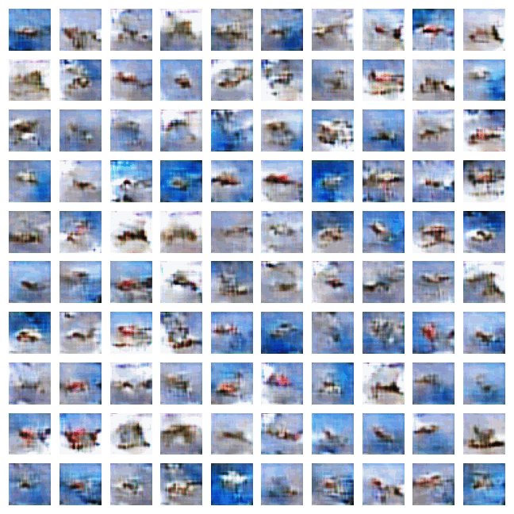
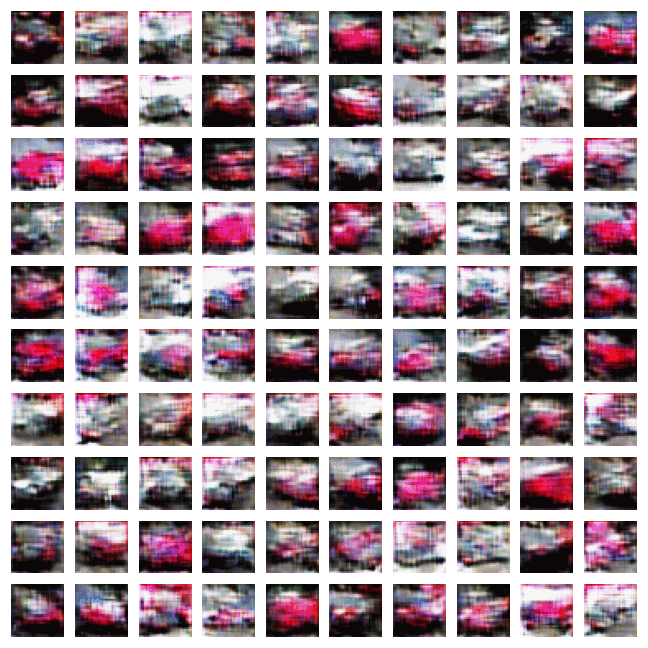
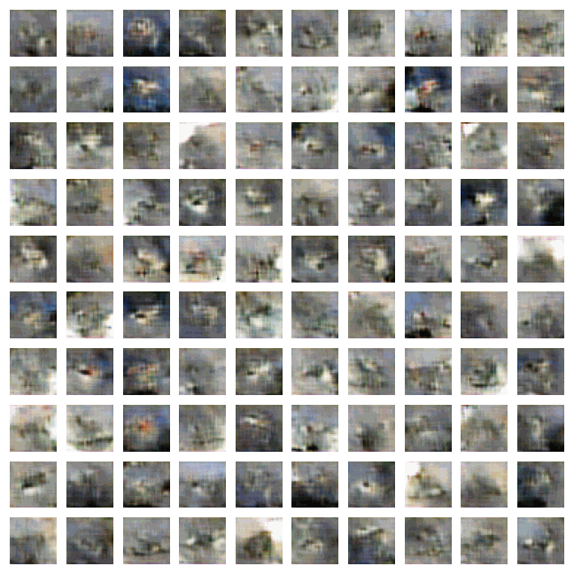
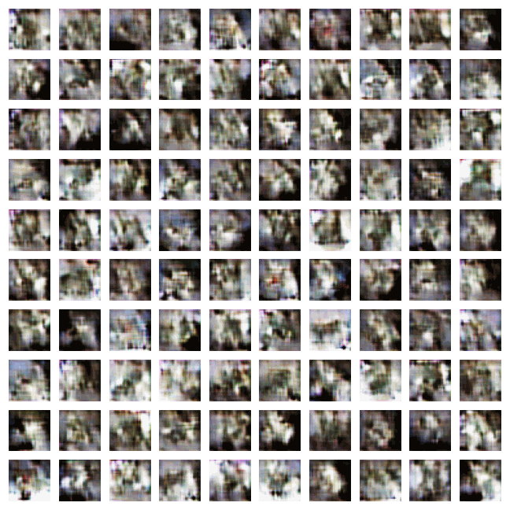
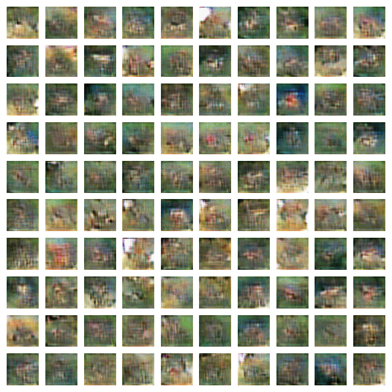
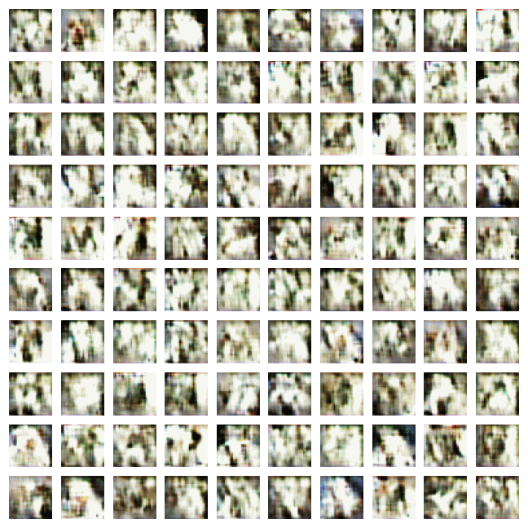
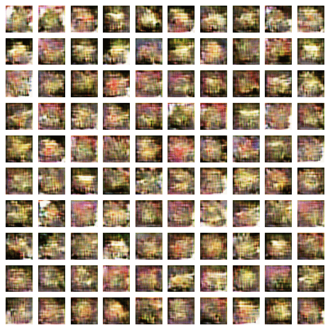
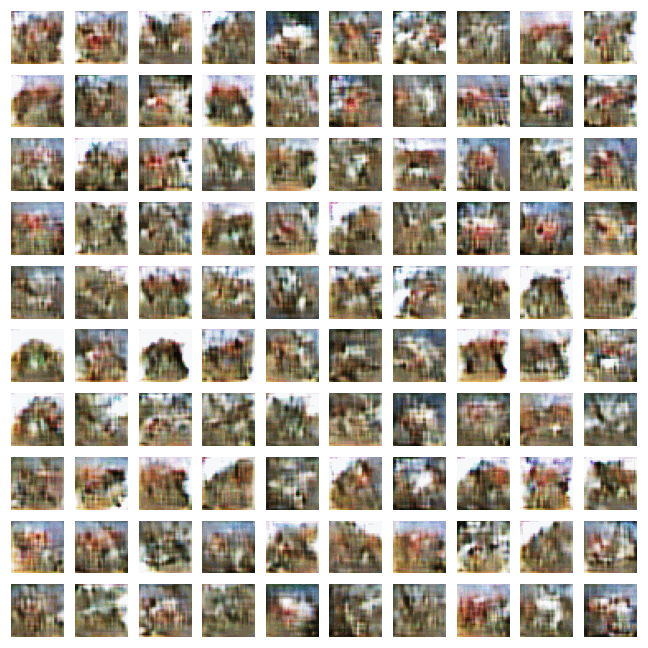
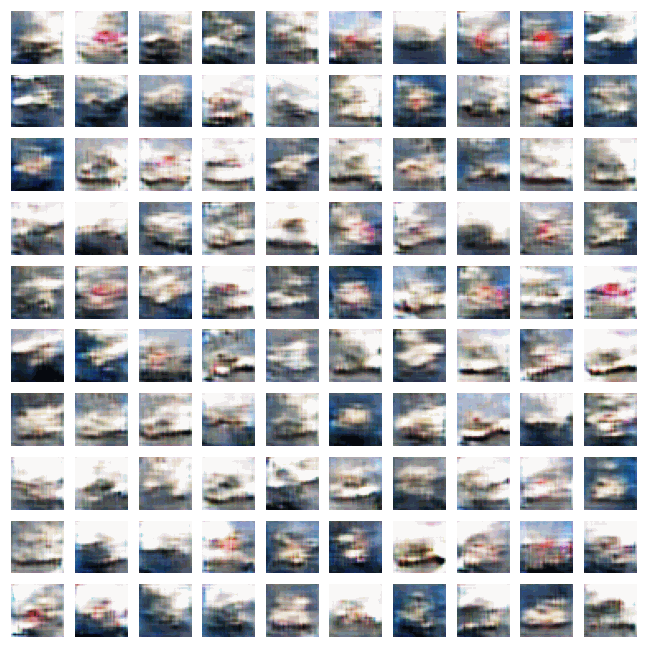
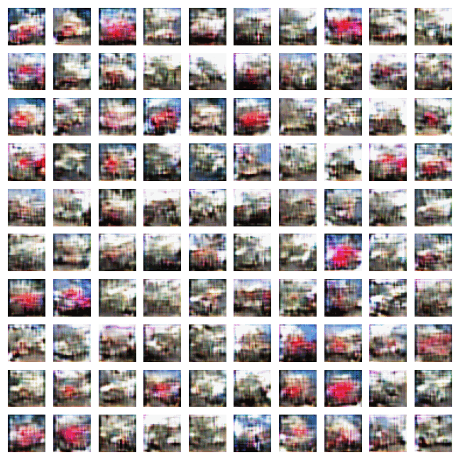

# Auxiliary Classifier with BigGAN Model Architecture (AC-BigGAN)

Author : Wong Zhao Wu, Bryan

Presentation Recording : https://youtu.be/gB1XcW5_n4o

# Abstract
In attempt to generate realistic and diverse image across multiple categories of CIFAR10, I have make use of [ACGAN](https://arxiv.org/pdf/1610.09585.pdf) as the primary framework with improvements from modern GAN network architecture like [BIGGAN](https://arxiv.org/pdf/1809.11096.pdf) backbone with [Conditional Batch-Norm](https://paperswithcode.com/method/conditional-batch-normalization) and improvements in training techniques such as implementation of [hinge loss](https://paperswithcode.com/method/gan-hinge-loss), [Orthogonal Initialization](https://arxiv.org/pdf/1312.6120.pdf) and label-smoothing for auxillary loss.

For evaluation, both the Inseption Score (IS) and Frechet Inception Distance (FID) are employed to provide quantifiable indication of the quality and diversity of image generated. I managed to achieve FID of 45.04(*the lower the better*) with IS of 7.19(*the higher the better*) with 80 epoch and 8 hours of GPU-training-time on Colab's P-100 GPU.

Training a GAN is a great challenge due to the instability and the amount of time it consumes which limits the possibility of multiple experiments and fine-tuning in the context of an assignmnent. Despite the improvement mentioned above, I have also attempted several model architecture techniques that is promised to improve the GAN's performance. However, due to lack of time and resource, I am unable to enjoy the performance boost as most of the training tends to collapse. Nevertheless, the zero-sum training techniques is revolutionary and I am excited to see how the same idea can be applied across multiple subfields of Deep Learning.

# Project Structure
The project is structured in a modularised format with and the following table describe the python scripts available followed by a brief description.

| File  | Description | 
| --- | --- |
| 📂`assets/*`    | Images attachements for markdowns in notebooks.|
| 📂`compiled-generated-image/*`      | 1000 generated images across 10-labels on different training epoch.|
| 📂`data/*`      | Downloaded CIFAR-10 image blob.|
| 📂`models/*`      | Scripts for implementing different model architechture for Generator and Discriminator modules.|
| └🐍`models/acgan.py` | Torch implementation of ACGAN with CNN Backbone.|
| └🐍`models/acwgangp.py` | Torch implementation of ACGAN with Gradient Penalty function.|
| └🐍`models/bigresnet.py` | Torch implementation of BIGGAN Resnet backbone with skipping connection of latent and conditional vectors to different depth of network.|
| └🐍`models/resnet.py` | Torch implementation of Resnet backbone and improvement on conditional information using cBN and Embedding layers.|
| └🐍`models/utils.py` | Utils for weight initialization of model.|
| 📂`notebook-archieve/*`      | Training notebooks for previous experiment iterations.|
| 📂`utils/*`      | Scripts of utility functions for training and evaluation process.|
| └🐍`utils/data.py` | Utils for loading CIFAR10 data with normalization.|
| └🐍`utils/DiffAugment_pytorch.py` | Official pytorch implementation of [Differentiable Augmentation](https://arxiv.org/pdf/2006.10738.pdf).|
| └🐍`utils/metrics.py` | Utils for model evaluation with FID and IS.|
| └🐍`utils/plot.py` | Utils for visualising generated image with class information.|

# Evaluation of Generated Images with GIF
### Airplane

### Automobile

### Bird

### Cat

### Deer

### Dog

### Frog

### Horse

### Ship

### Truck

